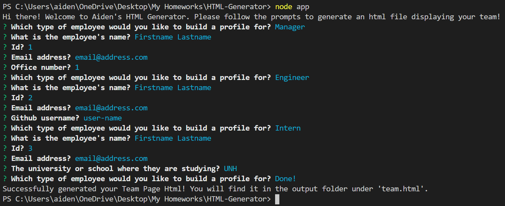

# HTML Generator 



    
### Description

Built using TDD, **HTML Generator** is a software engineering team generator command line application. The application prompts the user for intormation about each team member, a mix of engineers and interns. When the user is finished building their team, the application will generate an HTML file that displays a nicely formatted team roster based on the information provided by the user.

---

#### Table of Contents
- [Description](#description)
- [User Story](#user)
- [Installation](#installation)
- [Tests](#tests)
- [Demo](#demo)
- [Technologies Used](#technologies)
- [License](#license)
- [Sources](#sources)
- [Questions](#questions)

---

### User Story

```
As a manager
I want to generate a webpage that displays my team's basic info
so that I have quick access to emails and GitHub profiles
```

### Installation

In the command line, run: ``` npm install ```.

### Tests

In the command line, run: ``` npm run test ```.

### Demo


> ***To see a full demo, [click here!](https://youtu.be/aHkJakCZwB8)***

### Technologies Used

- Node.js
- NPM
- Inquirer
- Jest
- Bootstrap
- JSON

#### Sources
Simple waves styling provided by [Goodkatz!](https://codepen.io/goodkatz/pen/LYPGxQz)


#### License
This project is licensed under MIT. 

#### Questions
    
If you have any questions, please [email me.](mailto:aiden.threadgoode@gmail.com)
If you'd like to see more of my work, feel free to check out [my github!](https://github.com/a-thread)

*© 2020 Aiden Threadgoode*
    
